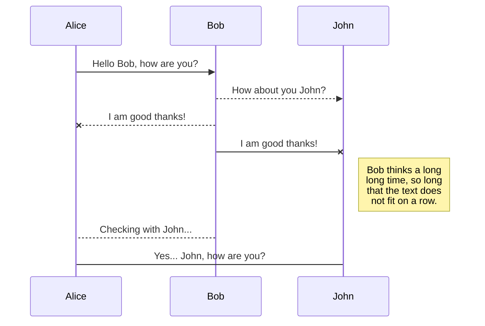

## Code
```rust
fn main() {
    println!("hello world !")
}
```

## Math
- $1+1=2$

- $e^{i\pi}+1=0$


$$\int_0^{+\infty}\dfrac{\sin(t)}{t}\,dt=\dfrac{\sqrt{\pi}}{2}$$

- [x] Write the press release
- [ ] Update the website
- [ ] Contact the media

I need to highlight these ==very important words==. 

H~2~O

X^2^

term
: definition 


## Links and images


for markdown documentation, see [here](https://commonmark.org/help/)

Wikilinks are supported too: [[https://en.wikipedia.org/wiki/Markdown|markdown]]

## Style
| unstyled | styled    |
| :-----:  | ------    |
| bold     | **bold**  |
| italics  | *italics* |
| strike   | ~strike~  |

> Hey, I am a quote !

## Lists
1) one
2) two
3) three

- and
- unorderded
- too

Even todo lists:
- [ ] todo
- [x] done




